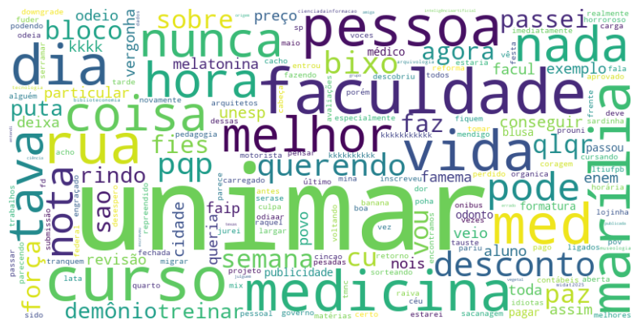

# WebScraping_Twitter
Esse projeto escava informações sobre uma query no twitter com Selenium e depois de processamento de dados e a criação de um Dataframe com pandas gera uma WordCloud com os termos mais recorrentes.

Para rodar o projeto, é necessário instalar todas as dependências e definir suas credências do Twitter em um arquivo .env na raiz do projeto. Depois, é só definir sua query e o número máximo de scrolls que o selenium vai dar (10 por padrão) e rodar as células do notebook.
